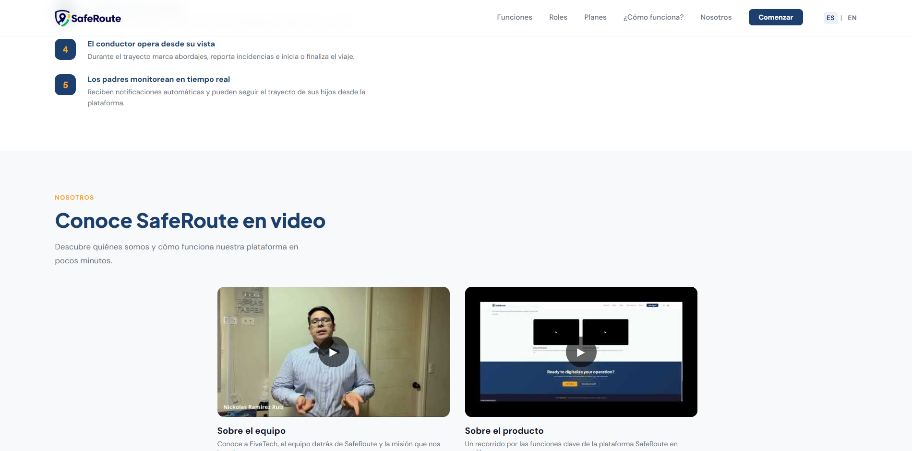

# SafeRoute Landing Page Solution

This is a solution for developing a landing page for SafeRoute, a digital platform designed for the management and monitoring of safe school transport.

## Overview
The SafeRoute Project enables the digitalization of private school transport operations, replacing traditional methods such as WhatsApp or paper-based systems with a centralised interface.

### Users can explore:
- Live route tracking for parents and administrators.

- Different views for administrators, drivers and parents.

- Instant recording of pupils getting on and off the bus, with automatic notifications.

- Options ranging from independent drivers to large fleets.

### Screenshots

### Links
- Solution URL : [[https://powertech-nrc12053.github.io/saferoute-website/](https://upc-pre-202610-1asi0730-12053-powertech.github.io/saferoute-website/](https://upc-pre-202610-1asi0730-12053-powertech.github.io/saferoute-website/))

### Build with
- Semantic HTML5 markup
- CSS Grid / Animation

### Author 
- PowerTech
